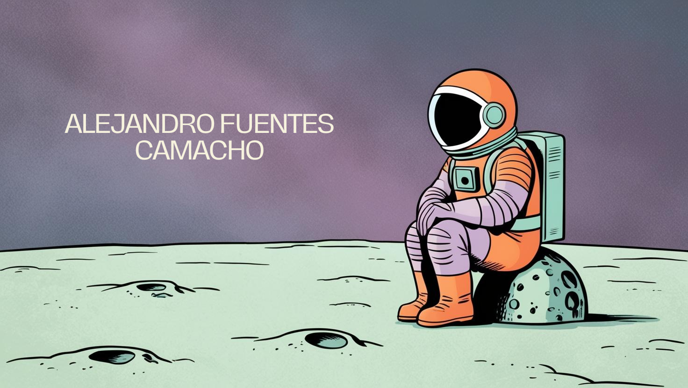

<h1 align="center">👋 Hi, I'm Alejandro Fuentes Camacho</h1>

---

🎓 Computer Engineering graduate from URJC &nbsp;·&nbsp; TFG: **9/10**

☁️ **AWS Certified Cloud Practitioner** &nbsp;·&nbsp; 🇬🇧 Cambridge B2 English

💼 1 year as **Cloud Operations & DevOps Engineer** at Telefónica Innovation Digital (Talentum Program)

🚀 Passionate about building robust systems, automating everything, and solving complex technical challenges

---

### 🛠️ Tech Stack

**Cloud & Infrastructure**

**Languages & Scripting**

**DevOps & Observability**

---

### 🏅 Certifications

---

### 📊 GitHub Stats

---

### 🔗 Contact

